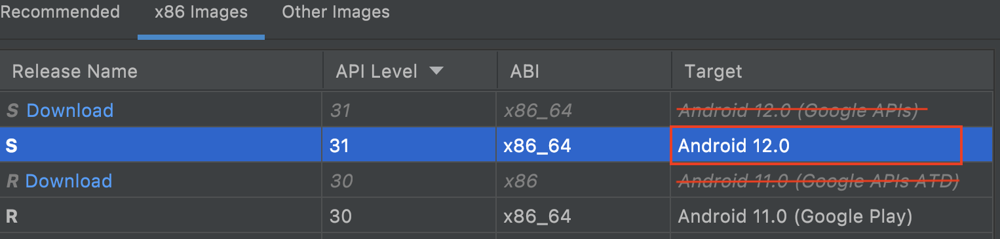
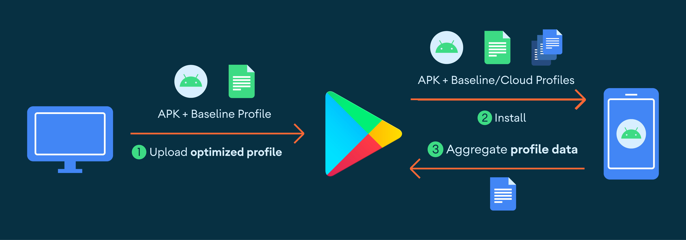
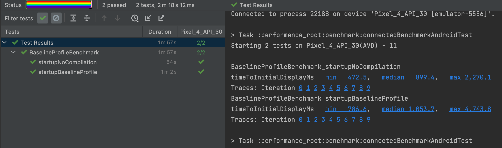

## Baseline Profiles

簡單來說就是放入一個預先編譯好的檔案，來加快Apk安裝和執行速度。除了本地端的檔案，Play商店會搜集各個裝置的檔案，最後整合出一個適合各種裝置的檔案，提供給使用者。

### 建立Baseline Profiles

1.在`build.gradle `加入依賴

```
dependencies {
     implementation("androidx.profileinstaller:profileinstaller:1.2.0-beta01")
}
```
2.設定[Macrobenchmark]模組

3.在產生完的Macrobenchmark模組中建立測試

```
@ExperimentalBaselineProfilesApi
@RunWith(AndroidJUnit4::class)
class BaselineProfileGenerator {
    @get:Rule val baselineProfileRule = BaselineProfileRule()

    @Test
    fun startup() =
        baselineProfileRule.collectBaselineProfile(packageName = "com.example.app") {
            pressHome()
            startActivityAndWait()
        }
}
```

4.連接`userdebug `或是經過`Rooted`的模擬器，並且要在Android 9(28)或以上的版本

這邊需要注意的是，模擬器不能選擇有`Google Play API`的模擬器，因為不能使用`adb root`在具有Google Play的模擬器使用。


 
5.在`terminal`執行`adb root `連接到模擬器，已確認已經連上

6.執行第3步寫好的測試

7. 執行完的測試後，在Test Result的視窗上找到類似的內容。

```
To copy the profile use:
`adb pull "/sdcard/Android/media/fu.trainnin.performancebenchmark/additional_test_output/BaselineProfileGenerator_startup-baseline-prof-2022-07-03-06-42-23.txt" .`
```

8.根據上一步的提示，將模擬器的檔案複製出來

9.將複製出來的檔案，重新命名為：`baseline-prof.txt`。並且移動到`src/main`的資料夾底下(與AndroidManifest.xml同一個階層)
 
### 支援的Android版本

|版本|編譯方法|優化方法|
|---|---|---|
|Android 5(21)到Android 6(23)|	完全使用AOT|在安裝過程中進行優化，會增加記憶體和硬碟空間的用量，從硬碟加載程式碼的時間也會更久，最後導致應用程序的等待時間變長，還有可能增加冷啟動的時間。|
|Android 7(24)到Android 8.1(27)|使用部分的AOT+Baseline Profile|Baseline Profile會在第一次執行時被安裝。ART 會在App執行時來加入額外的文件規則並在裝置閒置的時候進行編譯。這優化了硬碟加程式碼的時間，來減少了應用程序的等待時間。|
|Android 9(28)或更高|部分的AOT+Baseline Profile+雲端的Profile|Play商店在App安裝期間使用Baseline Profile和雲端的Profile(如果可以使用)來優化APK。安裝後，ART文件會上傳到Play商店並進行整合，然後在其他用戶安裝/更新時作為雲端的Profile提供給使用者。|

### 原理

Profile的規則會被編譯成二進制的格式到APK中，它的位置會在：assets/dexopt/baseline.prof。

在安裝App時，[Android Runtime (ART)]會對Profile文件中的方法進行預先編譯(AOT)，進而加快這些方法的執行速度。如果Profile包含了App啟動或渲染其中所使用的方法，使用者會體驗到更快的啟動時間或減少卡頓。



### 結論

除了App啟動的`Baseline Profile`，還有[更多範例](https://cs.android.com/androidx/platform/frameworks/support/+/androidx-main:benchmark/integration-tests/macrobenchmark/src/androidTest/java/androidx/benchmark/integration/macrobenchmark/GithubBrowserBaselineProfile.kt)可以使用，例如：電池、滑動等等...。

## 評估改善後的結果

### 使用Macrobenchmark模組評估改善後的結果

1.在`Macrobenchmark`模組中加入以下測試的程式碼

**注意：建議使用實體的手執行或有Google Play API的模擬器，使用沒有Google Play API的模擬器會失敗。**

```
@RunWith(AndroidJUnit4::class)
class BaselineProfileBenchmark {
    @get:Rule
    val benchmarkRule = MacrobenchmarkRule()
    
    @Test
    fun startupNoCompilation() {
        startup(CompilationMode.None())
    }
    
    @Test
    fun startupBaselineProfile() {
        startup(CompilationMode.Partial(
            baselineProfileMode = BaselineProfileMode.Require
        ))
    }
    
    private fun startup(compilationMode: CompilationMode) {
        benchmarkRule.measureRepeated(
            packageName = 你的package名稱,
            metrics = listOf(StartupTimingMetric()),
            iterations = 10,
            startupMode = StartupMode.COLD,
            compilationMode = compilationMode
        ) { // this = MacrobenchmarkScope
            pressHome()
            startActivityAndWait()
        }
    }
}
```

2.執行結果



### 參考

[Android Runtime (ART)]:https://source.android.com/devices/tech/dalvik
[Macrobenchmark]:https://developer.android.com/topic/performance/benchmarking/macrobenchmark-overview
